# team-loop — Autonomous Swarm with Self-Verifying TDD Loops

> *Each cycle triggers meta-validation: a skeptic scores alignment; low score halts. Snapshots capture intent, delta, confidence for breakpoint resume. Token budgets gate phases; coverage blocks hollow progress. Human only on value failure.*

---

## RSF Main Loop (11 steps, 14 flows)

```mermaid
flowchart TD
    GOAL["/goal &lt;target&gt;"]
    S1["seq1 main(GoalAgent)&#58; Parse → StandardGoal"]
    S2["seq2 main(Planner)&#58; Read RDF → 3-tier KR → TaskDAG + TokenEst"]
    S3["seq3 main(Controller)&#58; Pick KR → TaskUnit + Snap(t0) | /status + budget guard"]
    S4["seq4 main(Controller)&#58; Spawn coder 300s"]
    S5["seq5 coder(Executor)&#58; TDD 3-step → TaskResult + commit"]
    S6["seq6 main(Monitor)&#58; Distribute 120s"]
    S7R["seq7 reviewer(Critic)&#58; Correctness → Verdict"]
    S7T["seq7 tester(Critic)&#58; Dynamic + Coverage → Verdict + CovRpt"]
    S8["seq8 main(Monitor)&#58; Collect → spawn auditor"]
    S9["seq9 auditor(Critic)&#58; 13-item checklist → Verdict"]
    S10["seq10 main(Controller)&#58; 2/3 vote → Decision + TokenReport + Snap(t1)"]
    S11["seq11 publicist(Memory)&#58; RDF memory → MemoryEntry"]
    STOP["Stop: all-KR | FATAL | BUDGET | max_rounds | stagnation | escape | watchdog"]

    GOAL --> S1
    S1 -->|"f1 StandardGoal"| S2
    S2 -->|"f2 TaskDAG + TokEst"| S3
    S3 -->|"f3 TaskUnit"| S4
    S4 -->|"f4 async 300s"| S5
    S5 -->|"f5 TaskResult"| S6
    S6 -->|"f6 TaskResult"| S7R
    S6 -->|"f7 TaskResult"| S7T
    S7R -->|"f8 Verdict"| S8
    S7T -->|"f9 Verdict + CovRpt"| S8
    S8 -->|"f10 TskRes + Verdictx2 + CovRpt 120s"| S9
    S9 -->|"f11 Verdict"| S10
    S10 -->|"f12 TaskResult + Decision"| S11
    S11 -->|"f13 MemoryEntry feedback"| S2
    S10 -->|"fR retry / next_kr"| S3
    S10 --> STOP
```



---

## Architecture

- **11-step RSF** with formal `X ∈ A.out ∩ B.in` validation — all 14 flows programmatically verified closed
- **3-tier KR**: Foundation (K1) → Coverage (K2) → Quality (K3)
- **3-perspective verification**: reviewer + tester + auditor → 2/3 voting
- **9 interaction ID carriers** — end-to-end traceability

## Principles

1. Human defines goal, never enters loop
2. Different agents / different models / different verification methods
3. State on disk, fresh context every round
4. Infrastructure first — logging, IDs, exception capture before business code

## Features

| Feature | Mechanism |
|---------|-----------|
| Token budget guard | 80% downgrade → 90% no retry → 95% pause → 100% halt |
| Coverage gates | L1 syntax → L2 func (>80% line, >70% branch) → L3 semantic |
| Health scoring | `100 - ERROR×5 - WARNING×2 - risk_flags×3 - stagnation - excess retry` |
| Exception capture | L1 tool / L2 session / L3 loop + watchdog + crash log |
| Breakpoint resume | StateSnapshot(t0/t1): intent, delta, confidence per round |
| Test death penalty | Delete wrong tests; never patch them |

---

## Quick Start

```bash
/goal handler layer branch coverage 0%→≥50%, budget≤¥20
```

---

## Files

| File | Description |
|------|-------------|
| `SKILL.md` | Full English specification |
| `skill-cn.md` | Full Chinese specification |
| `README.md` | This file |

---

# team-loop — 自主任务循环引擎

> *每轮触发元验证：审查者评分对齐；低分暂停。快照捕获意图、增量、置信度支持断点续传。Token 预算门控各阶段；覆盖率阻止空洞进展。人仅在价值失败时介入。*

---

## RSF 主循环 (11步 14流)

```mermaid
flowchart TD
    GOAL["/goal &lt;目标&gt;"]
    S1["seq1 main(GoalAgent)&#58; 解析 → StandardGoal"]
    S2["seq2 main(Planner)&#58; 读RDF → 三层KR → TaskDAG + TokenEst"]
    S3["seq3 main(Controller)&#58; 取就绪KR → TaskUnit + Snap(t0) | /status + 预算守卫"]
    S4["seq4 main(Controller)&#58; 下发coder 300s"]
    S5["seq5 coder(Executor)&#58; TDD三步 → TaskResult + commit"]
    S6["seq6 main(Monitor)&#58; 分发 120s"]
    S7R["seq7 reviewer(Critic)&#58; 正确性审查 → Verdict"]
    S7T["seq7 tester(Critic)&#58; 动态验证 + 覆盖率 → Verdict + CovRpt"]
    S8["seq8 main(Monitor)&#58; 收判决 → 发auditor"]
    S9["seq9 auditor(Critic)&#58; 13项checklist → Verdict"]
    S10["seq10 main(Controller)&#58; 2/3裁决 → Decision + TokenReport + Snap(t1)"]
    S11["seq11 publicist(Memory)&#58; 沉淀RDF记忆 → MemoryEntry"]
    STOP["停止: all-KR | FATAL | BUDGET | max_rounds | stagnation | 逃逸 | watchdog"]

    GOAL --> S1
    S1 -->|"f1 StandardGoal"| S2
    S2 -->|"f2 TaskDAG + TokEst"| S3
    S3 -->|"f3 TaskUnit"| S4
    S4 -->|"f4 async 300s"| S5
    S5 -->|"f5 TaskResult"| S6
    S6 -->|"f6 TaskResult"| S7R
    S6 -->|"f7 TaskResult"| S7T
    S7R -->|"f8 Verdict"| S8
    S7T -->|"f9 Verdict + CovRpt"| S8
    S8 -->|"f10 TskRes + Verdictx2 + CovRpt 120s"| S9
    S9 -->|"f11 Verdict"| S10
    S10 -->|"f12 TaskResult + Decision"| S11
    S11 -->|"f13 MemoryEntry 反馈"| S2
    S10 -->|"fR retry / next_kr"| S3
    S10 --> STOP
```



---

## 核心原则

1. 人只定义目标，不进循环
2. 不同 agent / 不同模型 / 不同验证手段
3. 状态在磁盘，每轮 fresh context
4. 基础设施先行 — 日志、编号、异常捕捉在业务代码之前

## 功能

| 功能 | 机制 |
|------|------|
| Token 预算守卫 | 80% 降级 → 90% 不重试 → 95% 暂停 → 100% 终止 |
| 覆盖率门禁 | L1 语法 → L2 功能(>80%行, >70%分支) → L3 语义 |
| 健康度评分 | `100 - ERROR×5 - WARNING×2 - risk_flags×3 - 停滞 - 过度重试` |
| 异常捕捉 | L1 工具 / L2 Session / L3 循环 + 看门狗 + 兜底日志 |
| 断点续传 | StateSnapshot(t0/t1)：意图、增量、置信度 |
| 测试死刑 | 错误测试 → 删+重写，禁止修补 |

---

## 快速开始

```bash
/goal handler层分支覆盖率 0%→≥50%，预算≤¥20
```

---

## License

MIT
